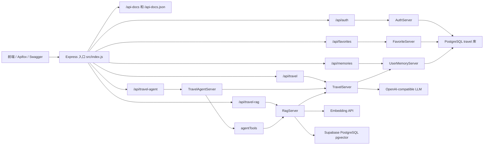

# 项目架构总纲

## 1. 项目背景

`travel-server` 是一个面向旅游规划场景的 Node.js 服务端。它向前端提供旅游推荐、流式 AI 对话、RAG 知识库问答、Agent 工具调用、用户登录、收藏、登录态对话记忆和 Swagger 在线联调能力。

当前项目定位偏学习与快速集成：大模型供应商通过 OpenAI 兼容接口接入，RAG 数据使用 Supabase PostgreSQL 与 pgvector，本地用户体系使用 PostgreSQL `travel` 数据库。天气、POI、路线规划工具当前包含教学用模拟数据，不能视作实时外部数据源。

## 2. 技术框架

| 层/领域 | 技术 | 当前用途 |
| --- | --- | --- |
| 运行时 | Node.js ESM | `type: module` 方式运行服务端源码 |
| Web 框架 | Express 4 | HTTP 路由、中间件、JSON/Form 请求解析 |
| 跨域 | cors | 支持本地前后端跨域访问 |
| 大模型编排 | LangChain Core、`@langchain/openai` | ChatOpenAI、System/Human/AI Message、流式输出、Embedding |
| 模型供应商 | DeepSeek、硅基流动、小米 | 通过 `MODEL_PROVIDE` 选择实际 LLM |
| RAG 数据库 | Supabase PostgreSQL、pgvector、`pg` | RAG 文档切片、向量写入、相似度检索 |
| 用户数据库 | PostgreSQL、`pg` | 用户、收藏、对话记忆数据表 |
| Supabase REST | `@supabase/supabase-js` | RAG 状态检查与 REST 连通性验证 |
| 流式协议 | Server-Sent Events | 普通聊天、RAG 聊天、Agent 聊天增量输出 |
| API 文档 | swagger-jsdoc、swagger-ui-express | `/api-docs` 在线文档，`/api-docs.json` 供 Apifox 导入 |
| 配置 | dotenv | 从根目录 `.env` 读取端口、模型、数据库和 RAG 参数 |
| 开发运行 | nodemon | `npm run dev` 监听 `src` 下 JS 文件 |

常用命令：

```bash
npm run dev
npm start
npm run db:init-auth
```

`npm test` 当前仍未配置可执行测试，会以失败状态退出。

## 3. 项目目录结构

```text
travel-server/
├── src/
│   ├── index.js                         # Express 应用入口、全局中间件、Swagger 与路由挂载
│   ├── swagger.js                       # OpenAPI 3.0 文档定义
│   ├── data.js                          # 未被入口引用的旅游提示词样例
│   ├── routers/
│   │   ├── auth.js                      # 注册、登录、当前用户、退出登录
│   │   ├── favorites.js                 # 登录用户收藏 CRUD
│   │   ├── memories.js                  # 登录用户对话记忆查询与清空
│   │   ├── travel.js                    # 基础推荐与普通 SSE 对话接口
│   │   ├── travelRag.js                 # RAG 状态、入库、检索与 SSE 对话接口
│   │   └── travelAgent.js               # Agent 工具列表与 Agent SSE 对话接口
│   ├── services/
│   │   ├── authServer.js                # 用户注册、登录、密码哈希与用户查询
│   │   ├── authToken.js                 # Bearer token 签发与校验
│   │   ├── favoriteServer.js            # 收藏列表、新增/更新、删除
│   │   ├── userMemoryServer.js          # 登录用户 LangChain 对话记忆持久化
│   │   ├── postgresClient.js            # 本地 PostgreSQL 连接池与查询封装
│   │   ├── travelServer.js              # LLM 初始化、行程推荐、普通聊天与可选记忆接入
│   │   ├── ragServer.js                 # 切片、Embedding、检索增强与 RAG 对话编排
│   │   ├── travelAgentServer.js         # 工具规划、顺序执行与最终回答编排
│   │   ├── agentTools.js                # Agent 工具定义和执行适配器
│   │   ├── supabaseClient.js            # Supabase JS 客户端及 REST 配置
│   │   └── supabaseRagStore.js          # pgvector 表初始化、向量写入与相似度检索
│   ├── middlewares/
│   │   └── authMiddleware.js            # requireAuth 与 optionalAuth
│   └── utils/
│       ├── streamUtils.js               # 普通/RAG SSE 响应封装
│       └── agentStreamUtils.js          # 带 requestId、messageId、seq、心跳的 Agent SSE 封装
├── migrations/
│   ├── 20260714_create_auth_users.sql   # 用户表与更新时间触发器
│   └── 20260714_create_user_features.sql# 收藏表与用户记忆表
├── scripts/
│   └── initAuthDb.js                    # 顺序执行 migrations 下全部 SQL
├── docs/
│   ├── auth-api.md                      # 认证、收藏、记忆与 Swagger 接口说明
│   └── frontend-integration.md          # 前端对接文档
├── AGENTS.md                            # Codex 项目规则
├── nodemon.json                         # 开发监听配置
├── package.json                         # 依赖与启动脚本
├── package-lock.json                    # npm 锁定依赖
├── README.md                            # 项目说明与接口示例
└── repowiki.md                          # 项目架构 Wiki 总纲
```

## 4. 架构总览

### 4.1 模块关系



### 4.2 接口边界

| 路由前缀 | 接口 | 职责 |
| --- | --- | --- |
| `/api` | `POST /heartbeat` | 服务可用性检查 |
| `/api-docs` | `GET /` | Swagger UI 在线调试文档 |
| `/api-docs.json` | `GET /` | OpenAPI JSON，供 Apifox 导入 |
| `/api/auth` | `POST /register` | 用户注册，返回用户信息和 token |
| `/api/auth` | `POST /login` | 用户登录，返回用户信息和 token |
| `/api/auth` | `GET /me` | 获取当前登录用户 |
| `/api/auth` | `POST /logout` | 统一退出登录响应，实际 token 清理由前端完成 |
| `/api/favorites` | `GET /` | 获取当前用户收藏列表 |
| `/api/favorites` | `POST /` | 新增或按业务目标更新收藏 |
| `/api/favorites` | `DELETE /:id` | 删除当前用户收藏 |
| `/api/memories` | `GET /` | 查询当前用户指定会话记忆 |
| `/api/memories` | `DELETE /:conversationId?` | 清空当前用户指定会话记忆 |
| `/api/travel` | `POST /recommand` | 生成 JSON 格式旅行行程，路由名沿用现有拼写 |
| `/api/travel` | `POST /chat` | 普通旅游助手 SSE 对话；登录后可启用用户记忆 |
| `/api/travel-rag` | `GET /status` | 检查 RAG 表与 Supabase REST 连通性 |
| `/api/travel-rag` | `POST /documents` | 切片、向量化并保存旅游资料 |
| `/api/travel-rag` | `POST /search` | 返回相似度检索结果，失败时降级为空结果 |
| `/api/travel-rag` | `POST /chat` | 先检索再生成的 SSE 对话 |
| `/api/travel-agent` | `GET /tools` | 返回已注册的 Agent 工具定义 |
| `/api/travel-agent` | `POST /chat` | 工具规划、工具执行与最终回答的 SSE 对话 |

### 4.3 主要运行时数据流

**认证与鉴权**：`auth` 路由调用 `AuthServer`。密码使用 Node `crypto.scrypt` 加盐哈希后写入 `travel_users`，登录成功后由 `authToken` 生成 HMAC 签名 token。受保护接口使用 `requireAuth`，可选登录态接口使用 `optionalAuth`。

**收藏功能**：`favorites` 路由整体挂载 `requireAuth`。`FavoriteServer` 根据当前用户 ID 读写 `travel_favorites`，前端未登录时无法收藏。

**登录态记忆**：`/api/travel/chat` 使用 `optionalAuth`。未登录时保持原有普通对话，不读取、不保存记忆；登录时 `TravelServer` 通过 `UserMemoryServer` 读取最近几轮对话并转成 LangChain `HumanMessage`、`AIMessage`、`SystemMessage`，模型回答完成后写回 `travel_user_memories`。

**基础对话/推荐**：请求由 `travel` 路由校验必要参数后交给 `TravelServer`。推荐接口解析模型 JSON，聊天接口将模型片段经 SSE 写回客户端。

**RAG 入库与检索**：`RagServer` 按配置切片，再调用 Embedding 接口生成向量。`SupabaseRagStore` 负责 pgvector/pgcrypto、`travel_rag_documents` 表、事务写入和相似度检索。RAG 对话把检索片段拼接到提示词，再调用 `TravelServer` 的 LLM。

**Agent 对话**：`TravelAgentServer` 优先请求模型输出工具调用计划；若解析失败，则使用规则计划兜底。随后顺序执行知识库、天气、POI、路线工具，并通过 `agentStreamUtils` 输出 `connected`、`plan_result`、`tool_start`、`tool_result`、`sources`、`chunk`、`complete` 等事件。

**Swagger 联调**：`src/swagger.js` 维护 OpenAPI 3.0 文档，入口挂载 `/api-docs` 和 `/api-docs.json`。Swagger 适合 JSON 接口调试；SSE 接口可描述参数和返回格式，但完整流式体验仍建议用前端页面或专用流式调试工具验证。

## 5. Coze 简化三层架构规范

本项目实际形成“入口/业务编排/基础能力”的三层结构。后续新增代码应沿用该方向，避免将存储、模型调用、鉴权或协议细节堆入路由文件。

### 5.1 页面/入口层

当前对应 `src/index.js`、`src/routers/` 和 `src/swagger.js`。

- `index.js` 只负责创建 Express 应用、注册全局中间件、挂载路由、挂载 Swagger 和监听端口；
- `routers` 负责 HTTP 参数的最小校验、鉴权中间件选择、状态码和响应协议选择；
- SSE 路由只负责建立流并转发业务层回调，不应包含模型提示词、SQL 或工具实现；
- Swagger 文档属于对外契约入口，更新接口时需要同步更新 `src/swagger.js` 和 `docs/`。

### 5.2 业务编排层

当前对应 `src/services/*Server.js`。

- `AuthServer` 编排注册、登录、密码哈希和用户安全输出；
- `FavoriteServer` 编排收藏列表、新增/更新和删除；
- `UserMemoryServer` 编排登录用户记忆查询、LangChain message 转换、写入和裁剪；
- `TravelServer` 编排模型初始化、行程推荐、普通对话和可选登录记忆；
- `RagServer` 编排切片、Embedding、检索和带上下文回答；
- `TravelAgentServer` 编排工具计划、执行、事件通知和最终回答。

业务服务可以依赖基础能力层，但不能反向依赖 Express 的 `req`、`res`。新的跨步骤业务流程应创建服务方法，不应由路由直接串联多个外部调用。

### 5.3 基础能力层

当前对应 `postgresClient.js`、`supabaseClient.js`、`supabaseRagStore.js`、`authToken.js`、`agentTools.js`、`utils/` 与 `migrations/`。

- 数据访问：PostgreSQL 连接池、Supabase 连接池、SQL、表初始化和向量查询封装在基础模块；
- 协议适配：普通 SSE 与 Agent SSE 通过工具模块统一响应头、事件格式和连接生命周期；
- 权限能力：`authToken` 和 `authMiddleware` 负责 token 签发、校验和登录态注入；
- Agent 工具：`agentTools.js` 将能力统一为名称、描述、参数、超时和执行器；
- 数据结构演进：`migrations/` 保存用户、收藏、记忆等表结构。

基础层不得处理 HTTP 请求，也不应承载具体路由决策。

## 6. 模块目录结构规范

### 6.1 当前目录与职责映射

| 目录 | 现有职责 | 新代码放置原则 |
| --- | --- | --- |
| `src/routers` | API 入口、参数基础校验、HTTP/SSE 响应 | 按资源域新增路由，不写模型或数据库细节 |
| `src/services` | 业务编排、模型访问、数据访问适配 | 优先按能力拆分；复杂 SQL 后续建议下沉 repository |
| `src/middlewares` | Express 中间件 | 鉴权、限流、错误处理、请求日志等横切能力 |
| `src/utils` | 无业务状态的协议和通用工具 | 只放跨领域复用工具或协议适配 |
| `migrations` | PostgreSQL 表结构变更 | 每次表结构变化新增 SQL 文件，保持可重复执行 |
| `scripts` | 本地初始化或维护脚本 | 不放请求时业务逻辑 |
| `docs` | 前后端对接与使用说明 | 接口变化时同步更新 |
| 根目录配置 | 启动、依赖、环境变量说明 | 不存放业务实现与密钥 |

### 6.2 推荐的增量目录结构

以下为功能继续增长时的建议，不是对当前已存在目录的事实描述：

```text
src/
├── routers/                 # HTTP 入口层
├── services/                # 业务用例/流程编排
├── repositories/            # 建议：独立所有数据库读写实现
├── integrations/            # 建议：LLM、天气、地图、Supabase 等外部系统适配器
├── tools/                   # 建议：Agent 工具定义与注册
├── middlewares/             # 鉴权、限流、统一错误、请求日志
├── schemas/                 # 建议：请求/响应校验 Schema
├── utils/                   # 通用无状态工具
└── config/                  # 建议：集中读取并校验环境变量
```

当某个 `services` 文件同时包含大量 SQL、供应商 SDK 初始化和复杂用例编排时，应优先抽出 `repositories` 或 `integrations`，使服务层保留流程语义。

## 7. 模块开发约定

### 7.1 新增接口

1. 在 `routers` 中定义资源域路由，完成字段存在性校验、鉴权选择与 HTTP/SSE 协议选择。
2. 将业务动作定义在 `services`；服务方法输入应是普通数据对象，不接收 `req`、`res`。
3. 复用 `streamUtils` 或 `agentStreamUtils`，不要在路由中手写不同的 SSE 响应头。
4. 在 `src/index.js` 按 `/api/<domain>` 挂载新路由。
5. 同步更新 `src/swagger.js`、`docs/` 和本 Wiki 的接口表。

### 7.2 鉴权与用户数据

- 需要登录的接口统一使用 `requireAuth`；
- 可选登录态接口使用 `optionalAuth`，例如 `/api/travel/chat`；
- 不向前端返回 `password_hash`、内部签名密钥、数据库连接信息；
- 收藏、记忆等用户数据必须用 `req.auth.user.id` 作为用户边界，禁止信任客户端传入的 `userId`。

### 7.3 模型、工具与存储

- 新模型供应商应在模型配置映射中明确所需环境变量，并在启动阶段校验；
- 新 Agent 工具应提供名称、描述、参数说明、超时值和结构化返回值；
- 外部工具必须标识真实数据或模拟数据；
- 数据库操作必须参数化，事务边界应由存储模块统一维护；
- 不将 API Key、数据库密码或连接串写入源码、文档示例中的真实值或提交记录。

### 7.4 命名、错误与测试

- 文件使用现有 camelCase `.js` 命名习惯，路由前缀使用 kebab-case；
- 成功响应统一包含可判断的成功标记；
- 错误响应提供可安全展示的中文提示，内部错误保留给日志；
- 异步路由必须捕获服务异常，避免未处理 Promise 导致进程不稳定；
- 新增服务或重要分支时，应补充单元测试；涉及 SSE 的接口应补充事件顺序与断连测试。

## 8. 依赖规则

```text
index / routers / swagger
      ↓
services（业务编排）
      ↓
postgres / supabase / integrations / utils / migrations（基础能力）
      ↓
LLM、Embedding、Supabase、PostgreSQL、地图、天气等外部系统
```

- `routers` 可以依赖 `services`、`middlewares` 和 SSE 工具，不能直接访问数据库或直接组装大模型调用；
- `services` 可以依赖数据存储、外部适配器、Agent 工具与通用工具，不能反向导入路由；
- `middlewares` 可以依赖认证服务和 token 服务，但不应承载业务流程；
- `utils`、存储模块、外部适配器不得依赖 Express 路由；
- Agent 工具可以调用业务服务或外部适配器，但避免工具之间相互调用；
- 任意模块不得通过循环 import 共享状态。共享配置应通过专用配置模块或显式参数传入。

## 9. 当前架构风险与优化建议

| 优先级 | 观察到的现状 | 影响 | 建议 |
| --- | --- | --- | --- |
| 高 | 项目未配置自动化测试，`npm test` 当前固定失败 | 改动难以验证，认证、SSE、RAG、记忆回归风险高 | 建立 Node 测试框架，优先覆盖鉴权、收藏权限、记忆写入、RAG 降级、Agent 事件序列 |
| 高 | 登录、收藏、记忆接口已接入，但缺少限流和登录失败次数限制 | 公网部署时可能被撞库、刷模型或刷数据库 | 增加基于 IP/账号的限流、登录失败锁定、接口级配额 |
| 高 | 全局启用 `cors()`，没有白名单 | 公网部署时任意来源可请求接口 | 按环境配置 CORS 白名单，生产环境仅允许前端域名 |
| 中 | 本地用户库和 Supabase RAG 库分属两套 PostgreSQL 配置 | 运维配置和迁移流程变复杂 | 在文档中明确数据边界；生产环境使用统一迁移工具和独立账号权限 |
| 中 | token 为无状态 HMAC token，退出登录主要由前端删除 | 无法服务端强制下线单个 token | 后续增加 `user_sessions` 或 refresh token 表，支持吊销和多端管理 |
| 中 | 对话记忆采用最近 N 条消息模式 | 长对话可能上下文膨胀或遗漏长期偏好 | 升级为“摘要记忆 + 最近消息”的组合策略 |
| 中 | 普通/RAG SSE 与 Agent SSE 事件信封不完全一致 | 前端需要维护多套解析逻辑 | 制定统一事件协议并兼容旧接口逐步迁移 |
| 中 | 请求主要为手写校验，缺少 Schema | 非预期输入可能导致错误响应不一致 | 引入 `schemas/`，使用 Zod/Joi 等统一校验 |
| 中 | Swagger 文档集中写在一个大对象中 | 接口增多后维护成本上升 | 按模块拆分 OpenAPI path/schema 定义，再在 `swagger.js` 汇总 |
| 低 | `src/data.js` 未被入口引用 | 维护者可能误判其为生效配置 | 删除样例或纳入明确的提示词模块 |

## 10. 待确认事项

- 服务部署拓扑、反向代理和公网暴露范围尚不能从代码确认；SSE 部署时需确认代理已关闭响应缓冲。
- 前端是否统一使用 `/api-docs.json` 导入 Apifox，以及是否已处理普通 SSE 与 Agent SSE 两种事件格式，需与前端项目核实。
- Supabase 项目的行级安全策略、数据库角色权限、备份和迁移流程未在本仓库中体现。
- 用户收藏和对话记忆是否属于需要长期保留的数据，以及删除、导出和隐私策略，需产品和安全负责人确认。
- 当前支持的模型与 Embedding 维度的生产组合、成本预算及限额策略，待运行环境配置与运营策略确认。

